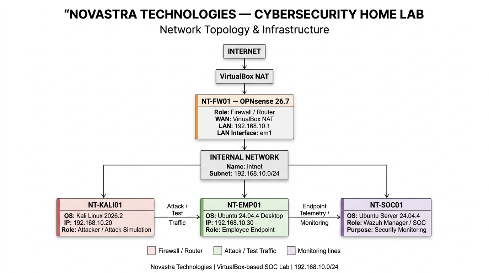
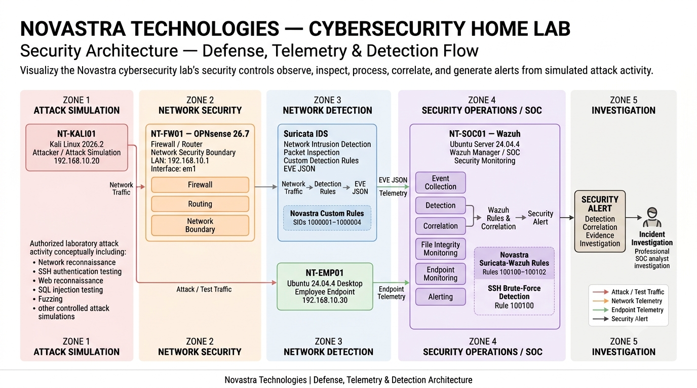
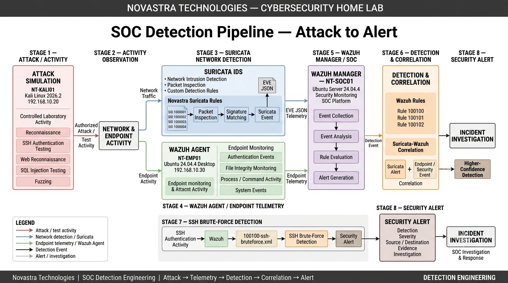
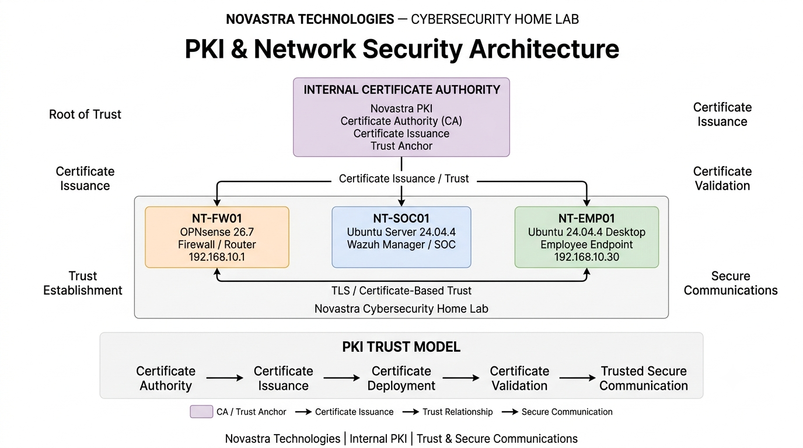

# Novastra Technologies — Cybersecurity Home Lab

A VirtualBox-based cybersecurity home lab designed to demonstrate practical skills in **network security, SOC operations, attack simulation, IDS detection, endpoint monitoring, SIEM correlation, vulnerability management, and incident investigation**.

The environment simulates a small enterprise network containing a firewall/router, attacker workstation, employee endpoint, and dedicated SOC monitoring infrastructure.

---

## Project Overview

The **Novastra Technologies Cybersecurity Home Lab** provides a controlled environment for performing authorized security testing and demonstrating defensive security capabilities.

The lab combines:

* Network segmentation
* Firewall and routing
* Public Key Infrastructure (PKI)
* Network Intrusion Detection
* Security Information and Event Management (SIEM)
* Endpoint monitoring
* File Integrity Monitoring (FIM)
* Attack simulation
* Vulnerability management
* Detection engineering
* Security alert correlation
* Incident investigation
* Packet-level network analysis

The project is structured as a portfolio demonstrating the complete security lifecycle:

```text
Attack Simulation
       │
       ▼
Network / Endpoint Activity
       │
       ├──────────────► Suricata IDS
       │                    │
       │                    ▼
       │              EVE JSON Telemetry
       │                    │
       │                    ▼
       │              Wazuh Manager
       │                    │
       │                    ▼
       │          Detection & Correlation
       │                    │
       ▼                    ▼
Endpoint Telemetry ───► Security Alert
                            │
                            ▼
                    SOC Investigation
                            │
                            ▼
                    Evidence / Response
```

---

# Architecture

The laboratory architecture is documented through four complementary diagrams covering the infrastructure, security controls, SOC detection workflow, and PKI/network-security design.

## 1. Network Topology & Infrastructure



The network is based on a segmented `192.168.10.0/24` internal laboratory network.

### Network Layout

```text
                         Internet
                            │
                            ▼
                   VirtualBox NAT
                            │
                            ▼
                 ┌──────────────────┐
                 │     NT-FW01      │
                 │    OPNsense      │
                 │    Firewall      │
                 │   192.168.10.1   │
                 └────────┬─────────┘
                          │
                     LAN / em1
                          │
                          ▼
                Internal Network
                     "intnet"
                  192.168.10.0/24
                          │
          ┌───────────────┼────────────────┐
          │               │                │
          ▼               ▼                ▼
   ┌─────────────┐ ┌─────────────┐ ┌─────────────┐
   │ NT-KALI01   │ │ NT-EMP01    │ │ NT-SOC01    │
   │ Kali Linux  │ │ Ubuntu      │ │ Ubuntu      │
   │ Attacker    │ │ Employee    │ │ Wazuh SOC   │
   │ .20         │ │ .30         │ │ SOC Server  │
   └─────────────┘ └─────────────┘ └─────────────┘
```

### Virtual Machines

| VM            | Operating System       | Role                         | IP Address      |
| ------------- | ---------------------- | ---------------------------- | --------------- |
| **NT-FW01**   | OPNsense 26.7          | Firewall / Router            | `192.168.10.1`  |
| **NT-KALI01** | Kali Linux 2026.2      | Attacker / Attack Simulation | `192.168.10.20` |
| **NT-EMP01**  | Ubuntu 24.04.4 Desktop | Employee Endpoint            | `192.168.10.30` |
| **NT-SOC01**  | Ubuntu Server 24.04.4  | SOC / Wazuh Manager          | SOC host        |

### VirtualBox Network Configuration

```text
Adapter 1
   │
   └── NAT
        │
        ▼
   Internet Access

Adapter 2
   │
   └── Internal Network: intnet
        │
        └── 192.168.10.0/24
```

The firewall provides the boundary between the virtualized environment's NAT connectivity and the isolated internal laboratory network.

---

# 2. Security Architecture — Defense, Telemetry & Detection Flow



The security architecture demonstrates how network and endpoint activity are collected, inspected, correlated, and presented to the SOC.

```text
                 ┌──────────────────────┐
                 │     NT-KALI01        │
                 │ Attack Simulation    │
                 │ 192.168.10.20        │
                 └──────────┬───────────┘
                            │
                       Test Traffic
                            │
                            ▼
                 ┌──────────────────────┐
                 │      NT-FW01         │
                 │      OPNsense        │
                 │    192.168.10.1      │
                 └──────────┬───────────┘
                            │
                            ▼
                 ┌──────────────────────┐
                 │      Suricata        │
                 │      Network IDS     │
                 └──────────┬───────────┘
                            │
                       EVE JSON
                            │
                            ▼
                 ┌──────────────────────┐
                 │      NT-SOC01        │
                 │   Wazuh Manager      │
                 │       SIEM/SOC       │
                 └──────────┬───────────┘
                            │
                 Detection / Correlation
                            │
                            ▼
                      SOC Alert
                            │
                            ▼
                     Investigation
```

At the endpoint layer:

```text
NT-EMP01
Ubuntu Endpoint
192.168.10.30
      │
      ├── Authentication Events
      ├── File Activity
      ├── Process Activity
      ├── System Events
      └── Security Telemetry
               │
               ▼
          Wazuh Agent
               │
               ▼
        Wazuh Manager
```

This creates two complementary monitoring paths:

**Network telemetry**

```text
Network Traffic
      ↓
  Suricata IDS
      ↓
   EVE JSON
      ↓
Wazuh Integration
      ↓
Detection / Correlation
```

**Endpoint telemetry**

```text
Endpoint Activity
      ↓
 Wazuh Agent
      ↓
Wazuh Manager
      ↓
Detection / Correlation
```

---

# 3. SOC Detection Pipeline — Attack to Alert



The detection pipeline demonstrates how controlled attack activity becomes actionable security telemetry.

```text
┌──────────────────────┐
│   Attack Simulation  │
│      NT-KALI01       │
└──────────┬───────────┘
           │
           ▼
┌──────────────────────┐
│ Network / Endpoint   │
│      Activity        │
└──────────┬───────────┘
           │
      ┌────┴────┐
      │         │
      ▼         ▼
┌───────────┐ ┌───────────────┐
│ Suricata  │ │ Wazuh Agent  │
│    IDS    │ │   Endpoint   │
└─────┬─────┘ └───────┬───────┘
      │               │
      ▼               ▼
┌─────────────────────────────┐
│       Wazuh Manager         │
│     SOC / SIEM Platform     │
└──────────────┬──────────────┘
               │
               ▼
┌─────────────────────────────┐
│ Detection & Correlation     │
│                             │
│ Suricata Rules:             │
│ 1000001 – 1000004           │
│                             │
│ Wazuh Rules:                │
│ 100100 – 100102             │
│                             │
│ SSH Brute Force Detection   │
└──────────────┬──────────────┘
               │
               ▼
        ┌──────────────┐
        │ SOC Alert    │
        └──────┬───────┘
               │
               ▼
        ┌──────────────┐
        │ Investigation│
        └──────────────┘
```

## Detection Engineering

The lab contains custom Suricata rules designed specifically for the controlled environment.

### Suricata Custom Rules

| SID       | Detection                               |
| --------- | --------------------------------------- |
| `1000001` | Kali → EMP01 TCP/3000 SYN activity      |
| `1000002` | Kali → EMP01 TCP connection             |
| `1000003` | ICMP traffic from Kali to EMP01         |
| `1000004` | Possible HTTP exploit-style GET request |

The rules are located in:

```text
detection-rules/
└── suricata/
    └── novastra_suricata.rules
```

### Wazuh Correlation Rules

| Rule ID  | Purpose                          | Level |
| -------- | -------------------------------- | ----: |
| `100100` | Base Suricata alert              |     5 |
| `100101` | Kali → EMP01 correlation         |     8 |
| `100102` | Destination TCP/3000 correlation |     9 |

The Wazuh rules are located in:

```text
detection-rules/
└── wazuh/
    └── novastra_suricata_wazuh_rules.xml
```

The SSH brute-force detection rule is also maintained separately:

```text
detection-rules/
└── wazuh/
    └── 100100-ssh-bruteforce.xml
```

---

# 4. PKI & Network Security Architecture



The PKI architecture documents the conceptual trust model used to support secure communications within the laboratory.

```text
                  ┌─────────────────────┐
                  │    Root / Lab CA    │
                  │   Trusted Authority  │
                  └──────────┬──────────┘
                             │
                     Certificate Trust
                             │
             ┌───────────────┼────────────────┐
             │               │                │
             ▼               ▼                ▼
       ┌───────────┐   ┌───────────┐   ┌───────────┐
       │ NT-FW01   │   │ NT-SOC01  │   │ NT-EMP01  │
       │ OPNsense  │   │ Wazuh SOC │   │ Endpoint  │
       └───────────┘   └───────────┘   └───────────┘
```

The repository documents the **architecture and security model** rather than storing private cryptographic material.

---

# Security Controls

The laboratory implements multiple defensive controls across different layers.

| Security Layer           | Technology             | Purpose                                |
| ------------------------ | ---------------------- | -------------------------------------- |
| Network Boundary         | OPNsense               | Firewalling and routing                |
| Network IDS              | Suricata               | Network traffic inspection             |
| SIEM / SOC               | Wazuh                  | Centralized monitoring and correlation |
| Endpoint Monitoring      | Wazuh Agent            | Endpoint telemetry                     |
| File Integrity           | Wazuh FIM              | Detect unauthorized file changes       |
| Vulnerability Management | Wazuh                  | Vulnerability assessment               |
| Packet Analysis          | Network captures       | Network-level evidence                 |
| Detection Engineering    | Custom rules           | Environment-specific detections        |
| PKI                      | Lab trust architecture | Secure communications / trust model    |

---

# Attack Simulation

The lab includes controlled attack simulations from **NT-KALI01** against the employee endpoint.

The attack-simulation workflow includes:

```text
NT-KALI01
192.168.10.20
     │
     ├── Network Reconnaissance
     ├── Service Enumeration
     ├── Web Reconnaissance
     ├── Authentication Testing
     ├── SSH Brute-Force Simulation
     ├── HTTP Testing
     └── SQL Injection Testing
             │
             ▼
          NT-EMP01
        192.168.10.30
```

All testing is performed inside the controlled laboratory environment.

---

# Network Evidence

Packet captures were used to validate actual communication between laboratory systems.

One observed communication path was:

```text
192.168.10.20
      │
      │ TCP
      │ Destination Port: 3000
      ▼
192.168.10.30
```

The captured traffic included:

* ARP resolution
* TCP SYN
* TCP SYN/ACK
* TCP ACK
* Application payload
* TCP FIN
* Session termination

Additional HTTPS traffic was observed between:

```text
192.168.10.1  →  192.168.10.30
```

This packet-level evidence provides validation of the network architecture and detection-engineering test cases.

---

# Wazuh SOC

**NT-SOC01** functions as the centralized SOC monitoring server.

The Wazuh deployment provides:

* Security event collection
* Endpoint monitoring
* File Integrity Monitoring
* Authentication monitoring
* Vulnerability management
* Security alert generation
* Custom detection rules
* Event correlation
* SOC investigation capabilities

The employee endpoint **NT-EMP01** runs the Wazuh Agent and forwards relevant security telemetry to the SOC infrastructure.

---

# File Integrity Monitoring

File Integrity Monitoring is used to identify changes to monitored files and directories.

The FIM workflow is:

```text
File / Directory
       │
       ▼
 Wazuh Agent
       │
       ▼
Change Detection
       │
       ▼
Wazuh Manager
       │
       ▼
Security Alert
       │
       ▼
SOC Investigation
```

The repository contains evidence demonstrating FIM testing and alert generation.

---

# Vulnerability Management

The vulnerability-management phase evaluates the laboratory endpoints for known security weaknesses and provides a defensive assessment workflow.

The documented process includes:

```text
Endpoint
   │
   ▼
Vulnerability Assessment
   │
   ▼
Detected Vulnerabilities
   │
   ▼
Risk Review
   │
   ▼
Remediation / Hardening
   │
   ▼
Validation
```

Evidence and documentation for the vulnerability-management phase are available under:

```text
docs/11-vulnerability-management.md
```

---

# Incident Investigation

The laboratory also demonstrates a basic SOC incident-investigation workflow.

```text
Security Event
      │
      ▼
Alert Generation
      │
      ▼
Initial Triage
      │
      ▼
Source / Destination Analysis
      │
      ▼
Network / Endpoint Evidence
      │
      ▼
Event Correlation
      │
      ▼
Determine Attack Activity
      │
      ▼
Document Findings
```

Relevant investigation documentation is available under:

```text
docs/12-incident-investigation.md
```

---

# Repository Structure

```text
Novastra-Cybersecurity-Home-Lab/
│
├── README.md
├── .gitignore
│
├── architecture/
│   ├── Network Topology & Infrastructure.png
│   ├── PKI & Network Security Architecture.png
│   ├── Security Architecture — Defense, Telemetry & Detection Flow.png
│   └── SOC Detection Pipeline — Attack to Alert.png
│
├── detection-rules/
│   ├── suricata/
│   │   ├── novastra_suricata.rules
│   │   └── suricata_eve.json
│   │
│   └── wazuh/
│       ├── 100100-ssh-bruteforce.xml
│       ├── novastra_suricata_wazuh_rules.xml
│       └── wazuh_alert.json
│
├── docs/
│   ├── 01-project-overview.md
│   ├── 02-lab-requirements.md
│   ├── 03-network-architecture.md
│   ├── 04-network-security-and-pki.md
│   ├── 05-wazuh-soc.md
│   ├── 06-endpoint-monitoring.md
│   ├── 07-fim.md
│   ├── 08-attack-simulation.md
│   ├── 09-detection-engineering.md
│   ├── 10-suricata.md
│   ├── 11-vulnerability-management.md
│   └── 12-incident-investigation.md
│
└── screenshots/
    ├── FIM-Test.png
    ├── phase-2-reconnaissance-nmap.png
    ├── phase-2-ssh-authentication-telemetry.png
    ├── phase-2-ssh-authentication-test.png
    ├── phase-2-web-reconnaissance-nikto.png
    ├── phase-3-wazuh-ssh-bruteforce-alert.png
    ├── phase2-authentication-testing-ffuf.png
    ├── phase2-burp-http-history.png
    ├── phase2-sqlmap-products-search_P1.png
    ├── phase2-sqlmap-products-search_P2.png
    ├── phase3-ssh-bruteforce-wazuh-detection.png
    ├── phase3-wazuh-ssh-bruteforce-P1.png
    ├── phase3-wazuh-ssh-bruteforce-P2.png
    ├── phase3-wazuh-sudo-detection-P1.png
    ├── phase3-wazuh-sudo-detection-P2.png
    ├── phase3-wazuh-sudo-detection-P3.png
    ├── phase3-wazuh-sudo-detection-P4.png
    ├── phase3-wazuh-suspicious-command.png
    ├── vulnerability-management-emp01-P1.png
    ├── vulnerability-management-emp01-P2.png
    ├── vulnerability-management-emp01-P3.png
    ├── vulnerability-management-soc01-P1.png
    ├── vulnerability-management-soc01-P2.png
    ├── vulnerability-management-soc01-P3.png
    └── vulnerability-management-soc01-P4.png
```

---

# Documentation

Detailed documentation is organized into individual chapters:

| Document                         | Topic                           |
| -------------------------------- | ------------------------------- |
| `01-project-overview.md`         | Project objectives and scope    |
| `02-lab-requirements.md`         | Hardware/software requirements  |
| `03-network-architecture.md`     | Network topology and addressing |
| `04-network-security-and-pki.md` | Network security and PKI        |
| `05-wazuh-soc.md`                | Wazuh SOC implementation        |
| `06-endpoint-monitoring.md`      | Endpoint monitoring             |
| `07-fim.md`                      | File Integrity Monitoring       |
| `08-attack-simulation.md`        | Controlled attack simulations   |
| `09-detection-engineering.md`    | Detection development           |
| `10-suricata.md`                 | Suricata IDS                    |
| `11-vulnerability-management.md` | Vulnerability assessment        |
| `12-incident-investigation.md`   | SOC investigation workflow      |

---

# Technology Stack

### Infrastructure

* VirtualBox
* OPNsense 26.7
* Ubuntu Server 24.04.4
* Ubuntu Desktop 24.04.4
* Kali Linux 2026.2

### Security

* Wazuh 4.14.7
* Wazuh Agent
* Suricata
* Custom Suricata rules
* Custom Wazuh rules
* File Integrity Monitoring
* Vulnerability Management
* PKI / TLS concepts

### Analysis

* Packet capture analysis
* Network traffic inspection
* Security-event correlation
* SOC alert investigation
* Attack-simulation telemetry

---

# Project Goals

The primary goals of the Novastra Technologies Cybersecurity Home Lab are to demonstrate practical understanding of:

1. Enterprise-style network segmentation
2. Firewall configuration and network security
3. SOC architecture
4. SIEM deployment and monitoring
5. Network intrusion detection
6. Endpoint security monitoring
7. File Integrity Monitoring
8. Vulnerability management
9. Attack simulation
10. Detection engineering
11. Security-event correlation
12. Packet-level investigation
13. Incident investigation
14. Security documentation

---

# Disclaimer

This project is an **authorized cybersecurity laboratory environment** created for education, testing, research, and portfolio demonstration.

All attack simulations and security testing activities are performed against systems owned and controlled within the laboratory environment.
